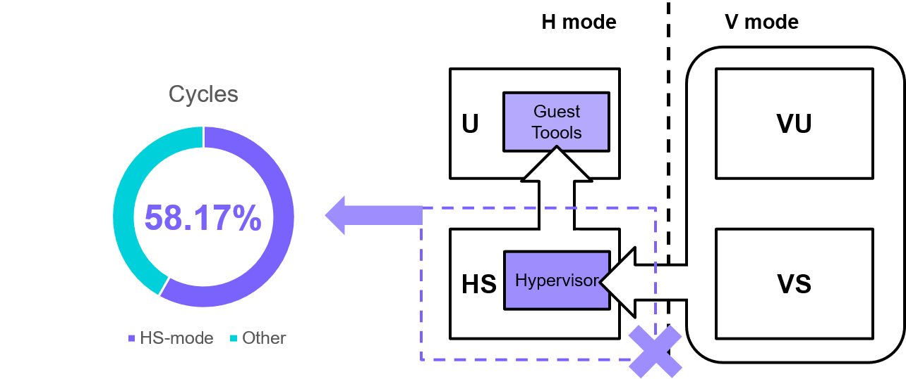

# Motivations
DuVisor mainly solves three problems faced by current virtualization technologies: Security, performance, and practicality.

## Security
let us first consider the most recognized attack scenarios on the cloud. As shown in Figure-1a, a cloud tenant could be malicious and tries to attack the host system and VMs of the other tenants.

Figure-1 Attack on the cloud

The malicious guest could first compromise a hypervisor module through vulnerabilities in it. Then the attacker can further take over the entire HS-mode for the lack of isolation in it as shown in Figure 1b.
Since the supervisor mode has been compromised, such attack would finally result in a compromise of the entire system, including the host applications and all the other VMs (as shown in Figure-1c).

Table-1 CVE analysis of KVM and Xen

We further analyzed the vulnerabilities in the CVE database for mainstream hypervisors and found that most of the vulnerabilities can lead to security issues to the host kernel, including privilege escalation, data leakage and denial of service as shown in Table-1. This ratio reaches 64% and 73% on KVM and Xen respectively.

## Performance
Current virtualization technologies have near-native performance with most workloads. However, the current split-mode design would introduce redundant mode-switching in some cases which reduces performance as shown in Figure 2.

Figure-2 Redundant mode-switching

VMs have to trap into supervisor mode first and then be forwarded by the kernel to user space for the real handling. Such redundant forwarding lead to a performance overhead about fifty-eight percent according to our test.

## Practicality
Current virtualization technology should be improved to be more practical due to long development velocity, difficulty in updating and high development complexity. We see that moving more hypervisor components to user space can shorten the development velocity and improve project quality. Compared to the complicated internal interface in kernel, programming in the user space is much less difficult. Developers can also develop hypervisors with richer software ecology in user space. For example, the hypervisor could be built with memory-safety languages such as RUST and Java and use the safe library they provide. They can also get more and better tools to check bugs like memory leaks. Also, it makes the operations and maintenance flexible. Code in user space can be updated without reboot, and it is easier to implement live upgrade in user space.