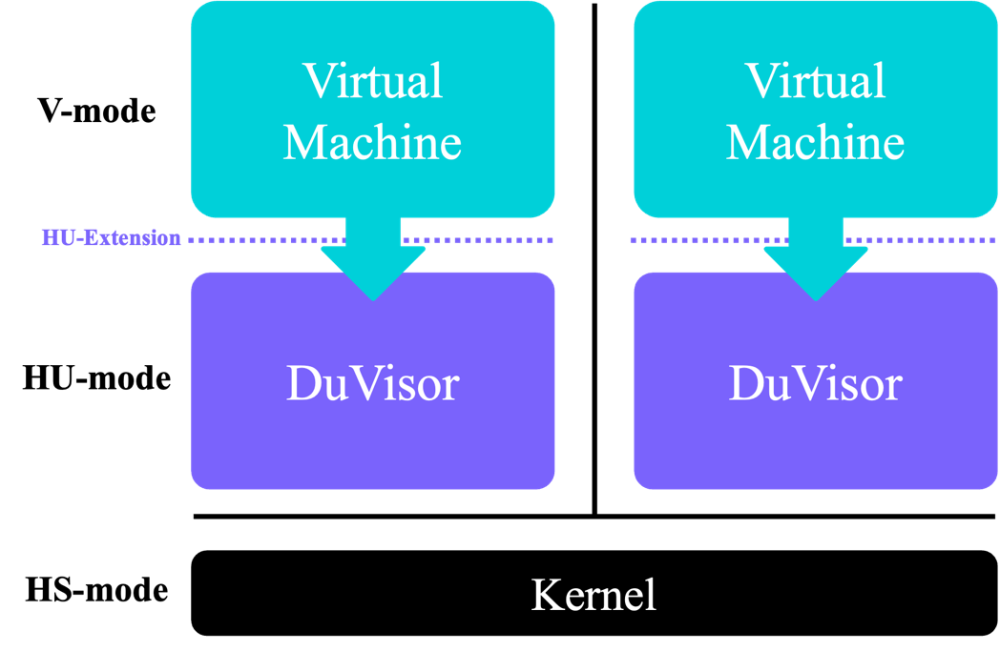
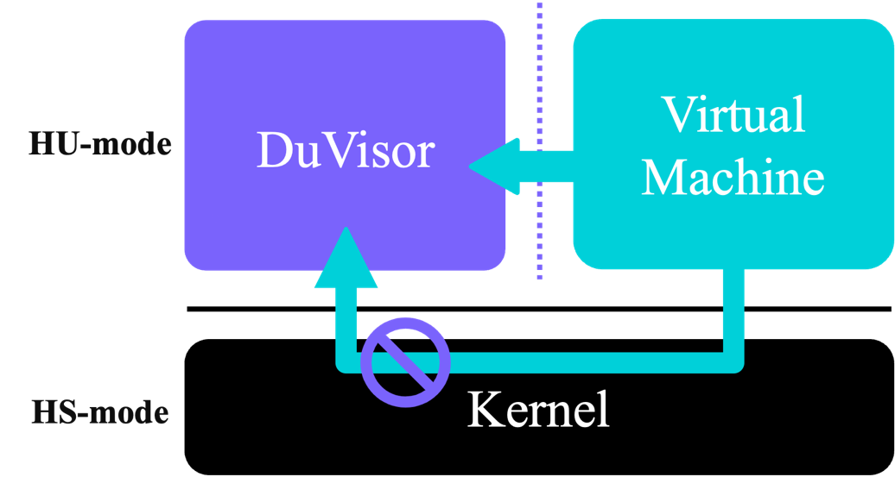
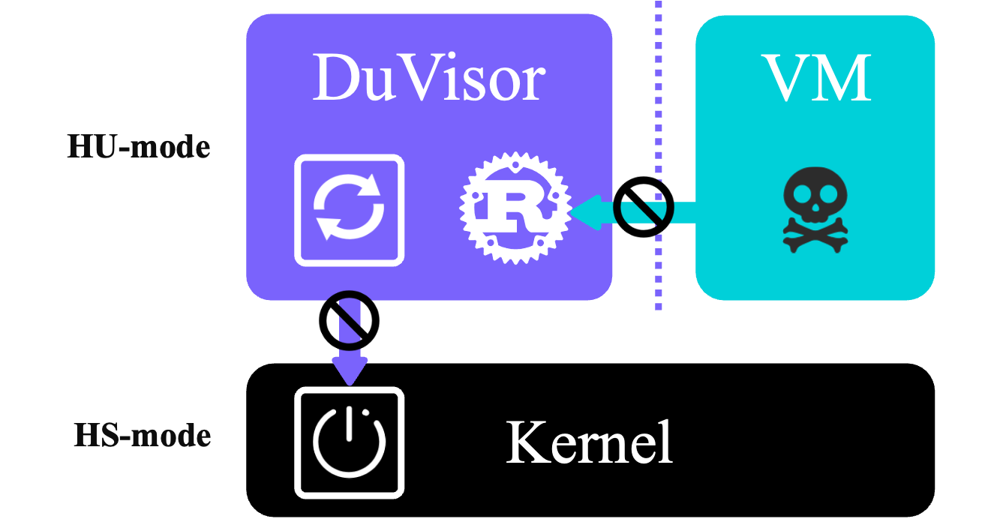

# DuVisor’s Solution
We built a user-level hypervisor called DuVisor to address the flaws mentioned in [Motivation](./motivation.md)).
## Stronger Security
DuVisor deprivileges most functionalities of hypervisor to the user space so that the kernel’s attack surface introduced by virtualization can be eliminated. The one-to-one service model further enhances the isolation between VMs and the fault tolerance of the entire system. Such isolation model (as shown in Figure-1) not only protects the host kernel, but also improves the isolation of VMs for the non-shared hypervisor.

Figure-1 Strong isolation model of DuVisor

## Near-native Performance
Because of the direct VM exit handling in user space as shown in Figure-2, DuVisor gets rid of the redundant mode switching to completely unleash the potential performance of virtualization. Its all-in-one design further enhances the cooperation between modules to make the code more efficient.

Figure-2 Direct VM exit handling in user space

## Better Operations and Maintenance
As shown in Figure-3, benefit from the thriving software environment in user space, DuVisor is developed in the memory-safe language Rust. With the rich libraries and testing framework provided by Rust, this project can be developed in an efficient and high-quality way. Each upgrade of DuVisor can be completed without host reboots. Stronger fault tolerance also leads to more stable cloud services and better management.

Figure-3 Better O&M
